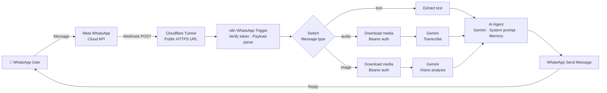

<div align="center">

# 🤖 WhatsApp AI Agent

### A multimodal AI agent that reads, listens, sees and replies on WhatsApp

**Text, voice notes and images in. Context-aware AI replies out. Built on n8n, Gemini and the Meta WhatsApp Cloud API.**


</div>

---

## 💡 The problem

Businesses get flooded with WhatsApp messages. Customers send text, voice notes and photos. Humans can't reply 24/7, and basic chatbots break the moment someone sends a voice note.

**This agent handles all three input types and replies like a human assistant. Instantly.**

---

## ✨ What it does

| Input | How the agent handles it |
|---|---|
| 💬 **Text** | Understands intent and replies with a context-aware answer |
| 🎙 **Voice note** | Downloads the audio, transcribes it with Gemini, then reasons over the content |
| 🖼 **Image** | Downloads the media, analyses it with Gemini vision, then replies about what it sees |

Every reply goes back through the WhatsApp Cloud API to the same chat, end to end, with no human in the loop.

---

## 🏗 Architecture



---

## 🧰 Tech stack

| Layer | Technology |
|---|---|
| **Orchestration** | n8n (self-hosted) |
| **LLM** | Google Gemini Flash (text, audio transcription, vision) |
| **Messaging** | Meta WhatsApp Business Cloud API |
| **Ingress** | Webhooks with verify-token handshake |
| **Public endpoint** | Cloudflare Tunnel (cloudflared) |
| **Auth** | OAuth (trigger), access token (send), Bearer header auth (media download) |

---

## 🚀 Setup

### Prerequisites
- n8n running locally or on a server
- A Meta developer account with a WhatsApp Business app
- A Google Gemini API key
- cloudflared installed

### 1. Start n8n and expose it
```bash
n8n start
cloudflared tunnel --url http://localhost:5678
```
Copy the `https://*.trycloudflare.com` URL. That is your public webhook base.

### 2. Configure Meta
1. Create an app at developers.facebook.com and add the **WhatsApp** product.
2. Note your **App ID**, **App Secret**, **WhatsApp Business Account ID** and **Phone Number ID**.
3. Under **API Setup**, add your own number as a verified recipient.

### 3. Import the workflow
Import `workflow.json` into n8n, then set up credentials:

| Credential | Used by | Fields |
|---|---|---|
| WhatsApp OAuth | Trigger | Client ID (App ID), Client Secret (App Secret) |
| WhatsApp API | Send + media nodes | Access Token, Business Account ID |
| Header Auth | Download nodes | `Authorization: Bearer <token>` |
| Gemini API | AI nodes | API key |

### 4. Activate
Activate the workflow. n8n registers the webhook with Meta automatically. Send a message from your WhatsApp number to the test number.

---

## 🛠 Troubleshooting (lessons from the build)

<details>
<summary><b>"App ID already has a webhook subscription"</b></summary>

A known n8n trigger issue. Meta keeps an old subscription and n8n can't register a new one.

**Fix:**
1. In Meta App Dashboard → WhatsApp → Configuration, clear the webhook callback URL and unsubscribe from `messages`.
2. In Graph API Explorer, send `DELETE /{WABA_ID}/subscribed_apps`. Use the WABA ID path, not the App ID.
3. Deactivate and reactivate the workflow in n8n so it registers cleanly.
</details>

<details>
<summary><b>Webhook stops working after restart</b></summary>

Cloudflare quick tunnels generate a **new URL on every restart**. Re-register the webhook, or use a named Cloudflare tunnel with a fixed domain for anything beyond testing.
</details>

<details>
<summary><b>Everything breaks after 24 hours</b></summary>

Meta's temporary access token expires in 24 hours. For a stable setup, create a **System User** in Meta Business Settings and generate a permanent token.
</details>

<details>
<summary><b>n8n shows 404 "workflow without permissions"</b></summary>

Open the n8n editor via `http://localhost:5678`, not the tunnel URL. The tunnel is for Meta's webhook calls only.
</details>

<details>
<summary><b>Gemini model not found</b></summary>

Older Gemini model names get retired. Update the model in the Gemini node to a current Flash model.
</details>

---

## 🔐 Security

- No tokens, IDs or secrets are committed. Everything lives in n8n credentials.
- Webhook verification uses a verify token you set.
- Use a permanent System User token with minimum required permissions.
- For production, replace the quick tunnel with a fixed domain behind Cloudflare Access or a hosted n8n instance.

---

## 🗺 Roadmap

- [ ] Conversation memory across sessions
- [ ] RAG over a business knowledge base (FAQs, product docs)
- [ ] Human handoff when the agent's confidence is low
- [ ] Permanent hosting with a fixed webhook domain
- [ ] Analytics dashboard for message volume and response quality

---

## 🙏 Credits

Built on top of the open-source **n8n WhatsApp AI agent** workflow template, then extended and debugged for a Gemini-based multimodal setup.

---

<div align="center">

### Want an AI agent like this for your business?

I design and build production agentic AI for enterprises and growing teams.

<a href="https://github.com/daisywithai"></a>
<a href="https://linkedin.com/in/daisywithai"></a>
<a href="mailto:daisywithai@gmail.com?subject=WhatsApp%20AI%20Agent%20Enquiry"></a>

**Daisy Grace Thomas** · Agentic AI Lead Consultant · Founder, DaisyWithAI

</div>
